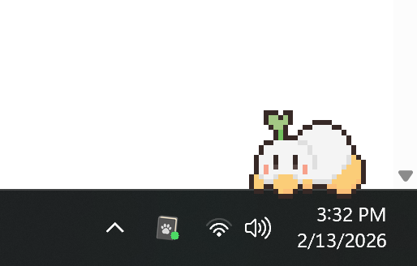
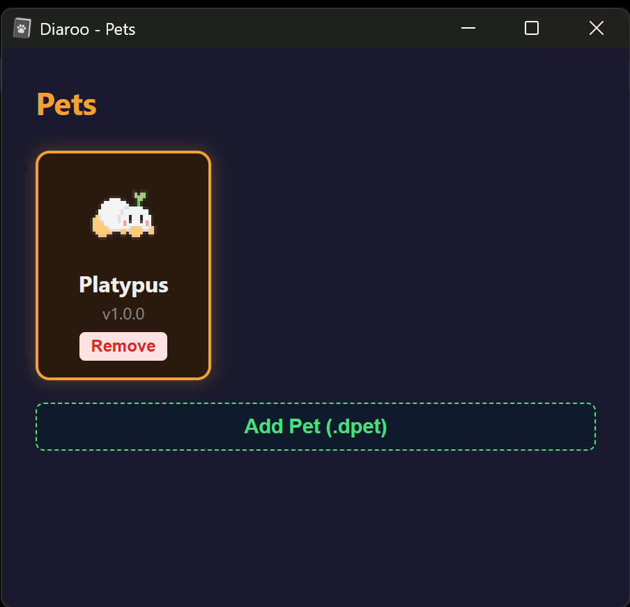

<p align="center">
  
</p>

<h1 align="center">Diaroo</h1>

<p align="center">
  <strong>A desktop pet that watches your screen and writes your daily diary with AI.</strong>
</p>

<p align="center">
  <a href="https://github.com/gab1717/diaroo/blob/main/LICENSE"></a>
  <a href="https://github.com/gab1717/diaroo/stargazers"></a>
</p>

---

A desktop pet app that monitors your activity and generates AI-powered daily digest reports. A little companion that sits on your screen, watches what you work on, and summarizes your day.

## Features

- **Desktop Pet** — An animated sprite-based pet that wanders your screen (currently a cat, with support for custom pets)
- **Activity Monitoring** — Periodic screenshots with window tracking, stored locally
- **AI-Powered Digests** — Uses LLM APIs (via OpenRouter) to analyze your activity and generate daily markdown reports
- **Scheduled Monitoring** — Auto-start monitoring at a configured time
- **Auto Reports** — Automatically generate end-of-day summaries
- **Custom Pets** — Install your own sprite-based pets
- **System Tray** — Runs as a background app with tray controls

## How It Works

Diaroo runs as a system tray application with a small animated pet window that sits on top of your desktop.

**Monitoring:** When you start a monitoring session (manually or on a schedule), Diaroo takes periodic screenshots at a configurable interval (default: every 5 seconds). It also captures the active window title to provide context about what you're working on. All screenshots are stored locally on your machine.

**Analysis:** Screenshots are batched together (default: every 5 minutes) and sent to your configured LLM provider. The LLM analyzes the screenshots, identifies what you were doing, and logs a summary of your activity. A deduplication step skips screenshots that look identical to avoid redundant analysis.

**Digest Reports:** At the end of the day (or on demand), Diaroo generates a daily digest — a markdown report summarizing everything you worked on, organized by activity. Reports can be viewed in the built-in reports viewer or generated for any past date that has activity data.

**The Pet:** While all of this happens in the background, an animated sprite-based pet wanders your desktop. It idles, walks, sits, sleeps, and reacts when you click on it. You can swap pets, resize them, or install custom ones with your own sprite sheets.

## Tech Stack

- **Frontend**: Svelte 5, TypeScript, Vite
- **Backend**: Rust, Tauri 2
- **Database**: SQLite (activity logs)
- **AI**: OpenRouter, Ollama, Claude Code, or Codex CLI

## Supported Platforms

- **macOS** (arm64, x64)
- **Windows** (x64)

## Prerequisites

- [Node.js](https://nodejs.org/) (LTS)
- [Rust](https://www.rust-lang.org/tools/install)
- [Tauri prerequisites](https://v2.tauri.app/start/prerequisites/) for your platform

## Setup

```bash
# Install dependencies
npm install

# Run in development mode
npx tauri dev

# Build for production
npx tauri build
```

## Configuration

On first launch, configure your settings via the system tray menu:

- **Screenshot Interval** — How often to capture (default: 5s)
- **Batch Interval** — How often to analyze screenshots (default: 300s)

Configuration is stored locally at `~/.config/diaroo/config.json`. Screenshots and reports are stored in `~/.local/share/diaroo/data`.

### LLM Providers

Diaroo supports multiple LLM providers for activity analysis and digest generation:

| Provider | API Key Required | Description |
|----------|-----------------|-------------|
| **OpenRouter** (default) | Yes | Cloud API with access to many models (Gemini, Claude, GPT, etc.). Set your OpenRouter API key in settings. |
| **Ollama** | No | Run models locally. Diaroo connects to `http://localhost:11434` by default, or set a custom endpoint. |
| **Claude Code** | No | Uses the `claude` CLI installed on your machine. Requires [Claude Code](https://docs.anthropic.com/en/docs/claude-code) to be installed and authenticated. |
| **Codex** | No | Uses the `codex` CLI installed on your machine. Requires [Codex CLI](https://github.com/openai/codex) to be installed and authenticated. |

For OpenRouter, you can configure the model in settings (default: `openai/gpt-4o-mini`). For Ollama, use any vision-capable model you have pulled locally.

## Custom Pets

See `sample-pets/` folder for examples. Place your custom pet folder with a `pet.json` manifest and `sprites/` directory, then install it through the Pet Picker UI.

## License

MIT


## Screenshots

<p align="center">
  
  <br />
  <em>Your pixel pet companion lives right on your desktop</em>
</p>

<p align="center">
  
  <br />
  <em>AI-generated daily digest with timeline, focus analysis, and behavioral insights</em>
</p>

<p align="center">
  
  <br />
  <em>Choose your companion — or add your own custom pet</em>
</p>

---

<p align="center">
  <sub>If Diaroo helped you remember what you did today, consider giving it a star.</sub>
</p>
